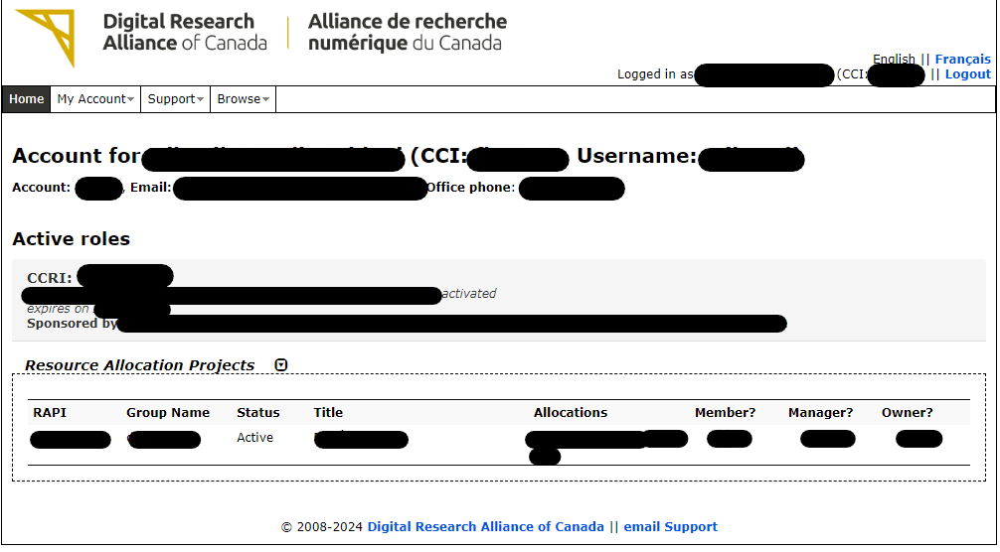
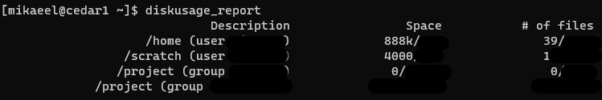

# An Introductory Guide in Using Compute Canada Servers

This is a simple guide for connecting to Compute Canada resources and take advantage of them for developing any ML or DL models.

## Table of Contents

- [An Introductory Guide in Using Compute Canada Servers](#an-introductory-guide-in-using-compute-canada-servers)
  - [Table of Contents](#table-of-contents)
  - [Introduction](#introduction)
    - [Home Page](#home-page)
    - [Resources](#resources)
    - [SSH Key Login](#ssh-key-login)
    - [Multifactor Authentication Management](#multifactor-authentication-management)
  - [Initial Connection](#initial-connection)
  - [Setup Local Environment](#setup-local-environment)
  - [Setup Compute Canada Environment](#setup-compute-canada-environment)
    - [Transfer Data and Code](#transfer-data-and-code)
    - [Prepare Environment](#prepare-environment)
    - [Job Queue and Code Execution](#job-queue-and-code-execution)
  - [External Resources](#external-resources)

## Introduction

Compute Canada is a series of clusters for researchers in need of resources to run their machine learning and deep learning application.
In this guide, we assume that you have already created an account in [Compute Canada](https://ccdb.alliancecan.ca/) and you can sucessfully sign-in.

### Home Page

After the signing into the account, the home page will show you a few critical information:

1. Username: This is the username that you have sign-up with. We'll later use this to ssh to our compute canada home directory.
2. Active Roles: This shows you your active subscription, the expiration date, and your sponser.
3. Resource Allocation Projects (RAP): The RAP is provides a bird's-eye-view of your number of resources, status of resources, and yoru role (which is most probably just Member).

Here is an example of the home page with important information highlighed:


### Resources

To check the resources that you have access to, hover on `My Account` and then select `My Resources and Allocation`. If you have access to a cluster, you will see the data storage available for your projects under `Allocations` column.
Each cluster has different sets of software, that you can check by clicking on this [link](https://alliancecan.ca/en/services/advanced-research-computing/accessing-resources/resource-allocation-competition/available-resources).
Also check each cluster type and usage by clicking on this [link](https://docs.alliancecan.ca/wiki/National_systems#Compute_clusters).

### SSH Key Login

To login using SSH Key, you can go to `Manage SSH Keys` in the `My Account` tab, and paste your public SSH key. This method is preferred over logging in by entering your password as
it is more secure and convinient.
If you don't know how to generate and use an SSH Key, follow [this guide for windows 10 and above](https://www.purdue.edu/science/scienceit/ssh-keys-windows.html) and [this guides for Unix-based operating systems](https://www.digitalocean.com/community/tutorial-collections/how-to-set-up-ssh-keys).

### Multifactor Authentication Management

To setup MFA on your account, go to `Multifactor Authentication Management`, in the `My Account` tab, click either on Duo Mobile or Yubico OTP (if you have one), and follow the on-screen guides.
We heavily recommend settin up MFA and SSH Key, for the best protection of your research account.

## Initial Connection

To connect to your Compute Canada head node, open a terminal and enter the following command:
`ssh username@cedar.computecanada.ca`.
If you have setup your ssh keys correctly, it should request a MFA approval and then sign you in.
If you didn't setup ssh keys, just use the password that you use to access your home page.
If you setup your ssh keys, but still it is asking you for password, run the following command and try again: `ssh-copy-id username@cedar.computecanada.ca`.
Note: The `username` is the username you have used to create your Compute Canada account.
After successfully logging in, you will be directed to your home directory, where you can at least see two directories:

1. `projects`: The projects folder is a shared space between members of our lab whom are using the CC clusters. It can be used for sharing data if you are working on common projects, and it is supposed to NOT change very frequently. Consider it a shared space for sharing mostly static files. (There is no issue for reading the data once it is transferred over the projects directory, but renaming, moving, and changing then frequently is not recommeneded).
2. `scratch`: If you want to have heavy read and write operations on large files (such as image data, etc.), scratch provides a temporary location for such data. Note that older files are subject to purging, so only use this directory for files that are most probably not needed after you train your model(checkpoint files, temporary logs, etc).

To check your available storage for each directory, simply run `diskusage_report` to get a list of storage with the space available to your user.


**Important**: Note that the home directory and cedar are not appropriate to performing any computation intensive task! Ignoring this rule might even result for your account to get banned. Use any computational task on the dedicated clusters.

**Important**: We strongly recommend taking a few minutes to read [this wiki page](https://docs.alliancecan.ca/wiki/Storage_and_file_management) for getting a more detailed information of the storage system.

## Setup Local Environment

*Note: we consider your project will have version control using Git, you know how to use Git to perform basic actions such as push/pull, and you use githubas your remote host.*
To have a compatible setup between your local environment and CC environemt, using python `virtualenv`s are necessary. This ensures that runtime environment for your application is similar between both your local system and remote cluster.
**Important Note**: By the time of writing this guide, the latest version of python available on CC clusters is `3.11.5`, which is what we are going to write our guide based on.
To setup the `virtualenv`, first install the package by using `pip install virtualenv`.
After the installation is completed, create a virtualenv by using `virtualenv -p python3.11.5 ml_cc_p3115`. You can replace `ml_cc_p3115` by any name you want.
Now to activate the virtual environment, run the following commands:

- Windows: `.\ml_cc_p3115\Scripts\activate`,
- Unix: `source .\ml_cc_p3115\Scripts\activate`

This will activate your virtual environment on your local machine.
Note: If you want to deactivate this virtual environement, simply type `deactivate` in your terminal.

Now you can go ahead and install any packages that you require for your project using `pip`.
After you are ready to submit your code for running in the cluster, in your project directory, run the following command:
`pip freeze > requirements.txt`.
This will make a list of all packages that are installed in your virtualenv, and will help CC to replicate the same environment to run your project as you had on your local machine.

After this, push your changes and your code to your github repository, and we will continue on CC to perform a simple operation.

## Setup Compute Canada Environment

Code execution on CC clusters requires a few steps that we are going to go through. 

### Transfer Data and Code

Code transfer can done by creating and registering your CC user space in your Github account as you did with your local computer. As a recommendation, we suggest you set a passphrase for your ssh key while creating it, since CC nodes are a remote server and the keys are not stored on your own hardware. After registering your CC on Github, clone your project code on your dedicated projects folder, that can be found in address: `~/projects/def-supervisorname/username/`.  To transfer large files, the best method that is also recommended by CC, is to use `Globus`. Of course if you want you can use other tools such as rsync, SFTP, or SCP to name a few, but keep in mind that the most reliable service is Globus for CC clusters.

**Important**: The best method to transfer over data files is to put compress them into a `tar` file, transfer the `tar` file over, and decompress the file into the appropriate directory (whether `scratch` or `$SLURM_TMPDIR`. `$SLURM_TMPDIR` is a temporary folder that has a fast read/write for small files (<1MB)) and is ideal for temporary small files that are created over the course of execusion.

### Prepare Environment

CC uses environment variables to determine the resources that you can use for code execution. Though you can input these variables in the execution script, we will define them in `.bashrc` file to prevent a repeating them each time.
Go to your `.bashrc` file and add the following to it:
```bash
export SLURM_ACCOUNT=def-supervisorname
export SBATCH_ACCOUNT=$SLURM_ACCOUNT
export SALLOC_ACCOUNT=$SLURM_ACCOUNT
```
After saving the changes, run `source ~/.bashrc` for your changes to take effect.

In order to setup the virtual environment, we first need to activate the correct python version module provided by CC.
To do so, run `module load python/3.11.5`. This command will allow you to use `virtualenv` to create a virtual environment to install packages that you require for your code.
After the module is loaded, create the virtual environment, and then install the necessary packages using the `requirements.txt` file, that you created locally. To do so, execute the following command:
`pip install --no-index -r /path/to/requirements.txt`
The `--no-index` flag tells pip to use wheels provided by CC, since they have been optimized for their environment. We recommend checking the list of availabel wheels while creating your project initially, to make sure all the pre-requirments of your project is satisfiable by CC prepared wheels.
Now that you have the environment ready, we can start the job queue to execute our project.

### Job Queue and Code Execution

Compute Canada clusters are shared between a lot of reserachers and students, therefore it is necessary for each task to be queued to get executed in a fair manner. To submit a task for the job queue, we need to create a bash executable file, and set our requirements for the job, so that CC can assign a place in the queue for our project and run it when the time comes. We will create a bash script named `job.sh`. Here is an example that you can use:
```bash
#!/bin/bash
#SBATCH --time=0:1:0
#SBATCH --mem=512M
#SBATCH --nodes=1
#SBATCH --ntasks-per-node=8

cd /path/to/project
module purge
module load python/3.11.5
source /path/to/env/bin/activate

python /path/to/script.py
```
Save this file, and put it in queue by running `sbatch /path/to/script/job.sh`.
To check the queue and execution status, run `sq` command, which will present you all the pending tasks.

## External Resources

For writing this guide, I have used the following resources:
- Compute Canada wiki page: https://docs.alliancecan.ca/wiki/Technical_documentation
- A blog post written by Prashant Pandey, A Complete Guide for using Compute Canada for Deep Learning!, July 7, 2021: https://prashp.gitlab.io/post/compute-canada-tut/

For any additional information, check CC wiki page
